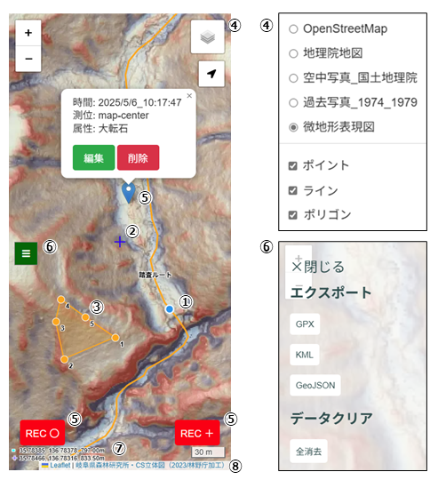

# 森林用webmap
森林の中で使えるweb地図（Leaflet）

# 概要
インターネットブラウザで地図上に現在地を表示。
気になった場所（POI）を登録・エクスポート。

① 現在地
① 画面中央
③ 目的地データ（サーバー上にGeoJSON形式で保存している場合のみ）
④ 地図の切り替え
⑤ POIの登録
⑥ POIのエクスポートまたは全消去
⑦ 緯度経度・標高（上段：現在地、下段：画面中央）
⑧ 著作権表示

# 利用法
微地形表現図が公開されている都府県について整備

| No　| 都道府県 | 微地形図 |林相図 |
| -------------| ------------- | ------------- | ------------- |
| 09 | [栃木](https://ikainoriyuki.github.io/webmap/09_tochigi/) | 有 | 有 |
| 13 | [東京（多摩地域）](https://ikainoriyuki.github.io/webmap/13_tokyo/) | 有 | 無 |
| 16 | [富山](https://ikainoriyuki.github.io/webmap/16_toyama/) | 有 | 有 |
| 19 | [山梨](https://ikainoriyuki.github.io/webmap/19_yamanashi/) | 有 | 無 |
| 20 | [長野](https://ikainoriyuki.github.io/webmap/20_nagano/) | 有 | 無 |
| 21 | [岐阜](https://ikainoriyuki.github.io/webmap/21_gifu/) | 有 | 無 |
| 22 | [静岡](https://ikainoriyuki.github.io/webmap/22_shizuoka/) | 有 | 無 |
| 26 | [京都](https://ikainoriyuki.github.io/webmap/26_kyoto/) | 有 | 有 |
| 27 | [大阪](https://ikainoriyuki.github.io/webmap/27_osaka/) | 有 | 無 |
| 28 | [兵庫](https://ikainoriyuki.github.io/webmap/28_hyogo/) | 有 | 有 |
| 38 | [愛媛](https://ikainoriyuki.github.io/webmap/38_ehime/) | 有 | 有 |
| 39 | [高知](https://ikainoriyuki.github.io/webmap/39_kouchi/) | 有 | 有 |
| 42 | [長崎](https://ikainoriyuki.github.io/webmap/42_nagasaki/) | 有 | 有 |

# 地図の差し替えと目的地データの登録

整備中

